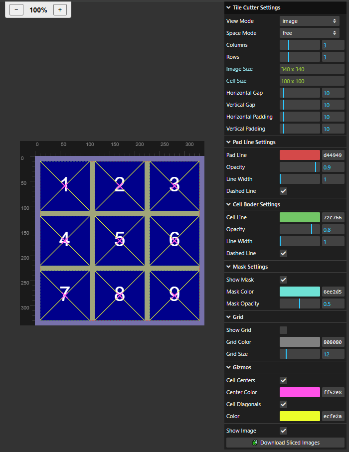
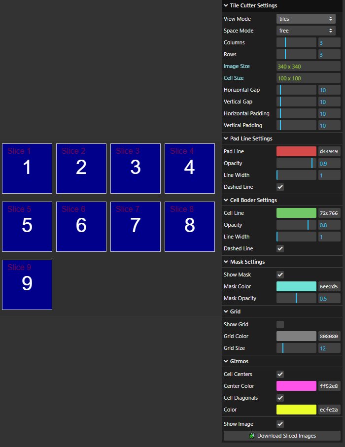
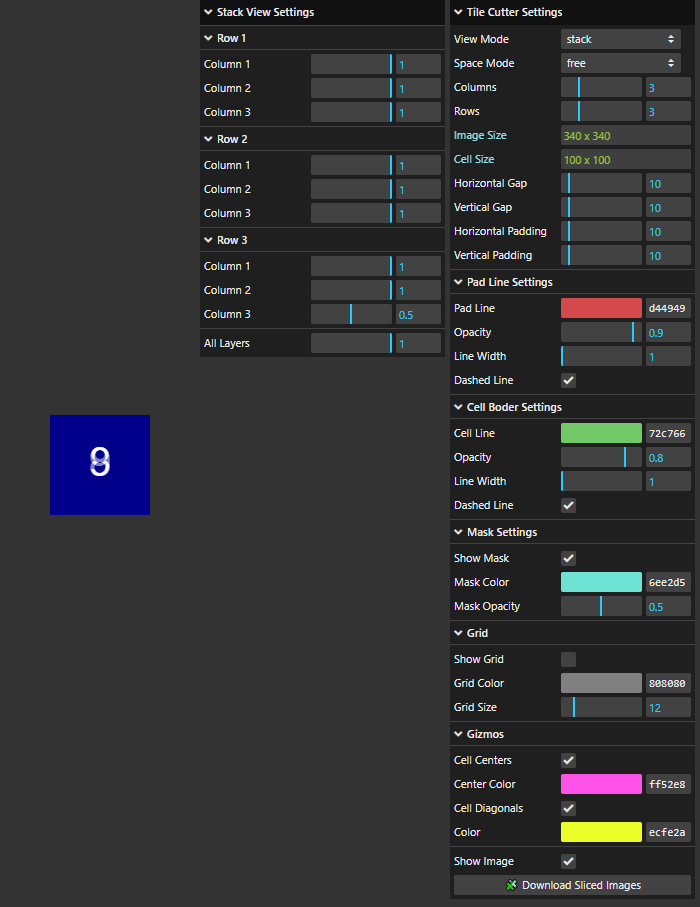

# tile-cutter

Tile Cutter is a lightweight tool for slicing images into tiles — perfect for avatars, sprites, and other grid-based assets.

[Demo](https://nvakalis.github.io/tile-cutter/) 

## Screenshots

<details>
<summary>📸 Click to expand screenshots for each view mode</summary>

### 🖼️ Image View Mode
<p align="center">
  
</p>

### 🧩 Tiles View Mode
<p align="center">
  
</p>

### 📦 Stack View Mode
<p align="center">
  
</p>

</details>


## Features

*   **Image Loading:** Load an image by dropping it onto the window.
*   **Customizable Settings:** Control the number of columns and rows, as well as the gap and padding between the grid tiles.
*   **Space Modes:** Supports both "free" and "uniform" modes, which determine whether padding and gaps are applied uniformly across both axes.
*   **Visual Aids:** Padding, Gap and Tile Border Lines, Rulers, Customizable Grid, Tile Centers and Diagonal Lines, White space Masking.
*   **Multiple Views:**
    *   **Image View:** Displays the original image with an optional grid overlay and cell borders.
    *   **Tiles View:** Displays the individual image slices as separate elements in an overlay.
    *   **Stack View:** Displays the image slices stacked on top of each other, with adjustable opacity for each slice.
*   **Exporting:** Download the sliced images as a ZIP archive.
*   **Zooming:** Zoom in and out in default image view.

## Usage

### 1. Load an Image
Drag and drop an image onto the designated area.

### 2. Adjust Slicing Settings
Use the graphical user interface (GUI) to customize the slicing settings. You can control the number of columns and rows, as well as the gap and padding between tiles. Experiment with "free" and "uniform" space modes to achieve the desired tile arrangement.

### 3. Select a View Mode
Choose between Image, Tiles, or Stack views to check the resulting tiles. Use stack view to check tile alignment.

### 4. Export
Click the '🧩 Download Sliced Images' button to download the slices as a ZIP archive.


## Development

### Prerequisites

*   Node.js (>=18.0.0)
*   npm (>=8.0.0)

### Installation

1.  Clone the repository:

    ```bash
    git clone https://github.com/nvakalis/tile-cutter.git
    cd tile-cutter
    ```

2.  Install dependencies:

    ```bash
    npm install
    ```

### Running the Application

1.  Start the development server:

    ```bash
    npm run dev
    ```

2.  Open your browser and navigate to `http://localhost:5173`.

## Technologies Used

*   HTML Canvas: Used for rendering various areas and visual aids.

*   [lil-gui](https://github.com/georgealways/lil-gui): A lightweight library for creating a graphical user interface to adjust slicing settings and view modes.

*   [JSZip](https://stuk.github.io/jszip/): ZIP manipulation

## License

[MIT](LICENSE)